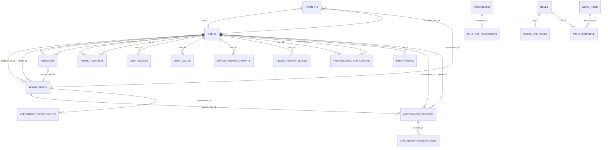

# Diccionario de Datos — Psicoguia (actualizado 2025-12-01)

Este documento describe el modelo lógico y físico de datos del aplicativo, sus entidades, relaciones, claves y restricciones. Está generado a partir de las migraciones y modelos Eloquent del proyecto en fecha 10/10/2025.

- Motor de BD (dev): PostgreSQL (Docker). Compatible con MySQL si se ajustan índices parciales y collations.
- Notación de tipos: se indican tipos genéricos (según migraciones). En PostgreSQL, `timestamp` = `timestamp without time zone`.
- Convenciones: claves primarias `id` autoincrementales (bigint o int según tabla); claves foráneas a `users.id` salvo que se indique.

## Modelo lógico (alto nivel)

Entidades principales y propósito:
- Usuario (users): identidad de pacientes y profesionales; presencia, estado, datos de perfil y seguridad.
- Rol/Permiso (Spatie): autorización basada en roles y permisos.
- Solicitud profesional (professional_applications): flujo de alta/validación del profesional (documentos y revisión).
- Citas (appointments): agenda entre profesional y paciente, con estados de aceptación.
- Mensajes (messages): mensajería 1:1 entre usuarios; lectura/no leídos.
- Amistades (friend_requests): modelo dirigido de solicitud/aceptación de amistad.
- Sesiones de usuario (user_logins): auditoría de sesiones con control de sesión abierta por navegador.
- Dispositivos (user_devices): gestión de dispositivos recordados con token hash.
- Reapertura de sesión (device_reopen_attempts / device_reopen_blocks): intentos y bloqueos de re-apertura 2FA por dispositivo.
- Fotos de usuario (user_photos): foto de perfil y galería.
- Infraestructura (jobs, cache, sessions, password_reset_tokens, failed_jobs, job_batches): soporte framework.

Relaciones clave (cardinalidades):
- User 1—N Appointment (como profesional) y 1—N Appointment (como paciente).
- User 1—N Message (enviados) y 1—N Message (recibidos).
- User N—N User vía FriendRequest (simétrica por pares; cuando status=accepted implica amistad).
- User 1—N UserDevice, 1—N UserLogin, 1—N DeviceReopenAttempt, 1—N DeviceReopenBlock.
- User 1—N UserPhoto; máximo una con is_profile=true como foto de perfil.
- User 1—N ProfessionalApplication (en la práctica 1—1 activa); y 1—N como reviewer via reviewed_by.
- Autorización: User N—N Role; Role N—N Permission; User N—N Permission (vía pivotes Spatie).

### Diagrama ER (Mermaid)

El diagrama siguiente resume las relaciones principales. Puede pegarse en herramientas que soporten Mermaid para visualizar.

Notas sobre el diagrama:
- `PAYMENTS` fue extendida para incluir `recipient_user_id` y `type` en noviembre de 2025.
- `APPOINTMENT_SESSIONS` es la entidad que representa sesiones en curso/realizadas (handshake/webrtc metadata, duración, etc.).

=== Diccionario físico por tabla (tablas principales) ===

Formato: `Columna | Tipo | Nulo | Default | Notas`

-- `users`

Columna | Tipo | Nulo | Default | Notas
---|---:|:---:|:---:|---
id | bigint PK | no | autoinc | usuario
name | varchar(255) | no |  | 
lastname | varchar(255) | yes |  | 
email | varchar(255) | no |  | unique, normalizado
password | varchar(255) | no |  | hash
phone | varchar(32) | yes | null | índice
timezone | varchar(255) | yes | null | 
speciality | varchar(255) | yes | null | profesional
appointment_types | varchar(255) | yes | null | 
location | varchar(255) | yes | null | 
rating | numeric(3,1) | yes | null | promedio
status | varchar(32) | yes | 'online' | índice (online/offline)
last_seen_at | timestamp | yes | null | índice
email_verified_at | timestamp | yes | null | 
remember_token | varchar(100) | yes | null | 
deleted_at | timestamp | yes | null | soft delete
created_at / updated_at | timestamp | no |  | 

-- `appointments`

Columna | Tipo | Nulo | Default | Notas
---|---:|:---:|:---:|---
id | bigint PK | no | autoinc | 
professional_id | bigint FK -> users.id | no |  | profesional
patient_id | bigint FK -> users.id | no |  | paciente
title | varchar(255) | yes | null | 
start | timestamp | yes | null | 
end | timestamp | yes | null | 
all_day | boolean | no | false | 
status | varchar(32) | no | 'pending' | estados: pending/accepted/in_progress/completed/cancelled
notes | text | yes | null | 
deleted_at | timestamp | yes | null | soft delete
created_at / updated_at | timestamp | no |  | 

-- `appointment_sessions`

Columna | Tipo | Nulo | Default | Notas
---|---:|:---:|:---:|---
id | bigint PK | no | autoinc | registro de sesión rtc
appointment_id | bigint FK -> appointments.id | no |  | 
room | varchar(255) | yes | null | id de sala/signaling
started_at | timestamp | yes | null | 
ended_at | timestamp | yes | null | 
duration_seconds | integer | yes | null | calculado
meta | json | yes | null | datos adicionales (ice, logs)
created_at / updated_at | timestamp | no |  | 

-- `appointment_session_logs`

Columna | Tipo | Nulo | Default | Notas
---|---:|:---:|:---:|---
id | bigint PK | no | autoinc | 
appointment_session_id | bigint FK -> appointment_sessions.id | no |  | 
type | varchar(64) | yes | null | event type
payload | json | yes | null | 
created_at | timestamp | no |  | 

-- `appointment_reschedules`

Columna | Tipo | Nulo | Default | Notas
---|---:|:---:|:---:|---
id | bigint PK | no | autoinc | 
appointment_id | bigint FK -> appointments.id | no |  | 
proposed_start | timestamp | yes | null | 
proposed_end | timestamp | yes | null | 
status | varchar(32) | no | 'pending' | 
created_at / updated_at | timestamp | no |  | 

-- `appointment_ratings`

Columna | Tipo | Nulo | Default | Notas
---|---:|:---:|:---:|---
id | bigint PK | no | autoinc | 
appointment_id | bigint FK -> appointments.id | no |  | 
patient_id | bigint FK -> users.id | no |  | quien calificó
professional_id | bigint FK -> users.id | no |  | calificado
score | integer | no |  | rango configurable
comment | text | yes | null | 
responded_at | timestamp | yes | null | respuesta del profesional
created_at / updated_at | timestamp | no |  | 

-- `messages`

Columna | Tipo | Nulo | Default | Notas
---|---:|:---:|:---:|---
id | bigint PK | no | autoinc | 
from_id | bigint FK -> users.id | no |  | 
to_id | bigint FK -> users.id | no |  | 
body | text | no |  | 
appointment_id | bigint FK -> appointments.id | yes | null | opcionalmente atado a cita
read_at | timestamp | yes | null | 
created_at / updated_at | timestamp | no |  | 

-- `friend_requests`

Columna | Tipo | Nulo | Default | Notas
---|---:|:---:|:---:|---
id | bigint PK | no | autoinc | 
from_id | bigint FK -> users.id | no |  | solicitante
to_id | bigint FK -> users.id | no |  | receptor
status | varchar(32) | no | 'pending' | pending/accepted/rejected
accepted_at | timestamp | yes | null | 
rejected_at | timestamp | yes | null | 
created_at / updated_at | timestamp | no |  | 
