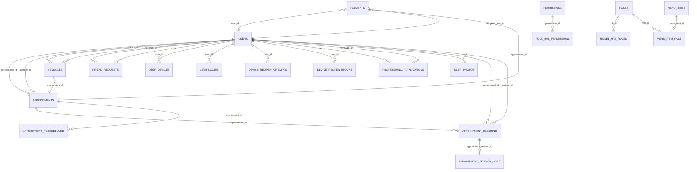

# Diccionario de Datos — Psicoguia (actualizado 2025-12-01)

Este documento describe el modelo lógico y físico de datos del aplicativo, sus entidades, relaciones, claves y restricciones. Está generado a partir de las migraciones y modelos Eloquent del proyecto.

- Motor de BD (dev): PostgreSQL (Docker). Compatible con MySQL si se ajustan índices parciales y collations.
- Notación de tipos: se indican tipos genéricos (según migraciones). En PostgreSQL, `timestamp` = `timestamp without time zone`.
- Convenciones: claves primarias `id` autoincrementales (bigint o int según tabla); claves foráneas a `users.id` salvo que se indique.

## Modelo lógico (alto nivel)

Entidades principales y propósito:
- Usuario (`users`): identidad de pacientes y profesionales; presencia, estado, datos de perfil y seguridad.
- Rol/Permiso (Spatie): autorización basada en roles y permisos.
- Solicitud profesional (`professional_applications`): flujo de alta/validación del profesional (documentos y revisión).
- Citas (`appointments`): agenda entre profesional y paciente, con estados de aceptación.
- Mensajes (`messages`): mensajería 1:1 entre usuarios; lectura/no leídos.
- Amistades (`friend_requests`): modelo dirigido de solicitud/aceptación de amistad.
- Sesiones de usuario (`user_logins`): auditoría de sesiones con control de sesión abierta por navegador.
- Dispositivos (`user_devices`): gestión de dispositivos recordados con token hash.
- Reapertura de sesión (`device_reopen_attempts` / `device_reopen_blocks`): intentos y bloqueos de re-apertura 2FA por dispositivo.
- Fotos de usuario (`user_photos`): foto de perfil y galería.
- Infraestructura (cache, sessions, password_reset_tokens, failed_jobs, job_batches, etc.).

Relaciones clave (cardinalidades):
- `users` 1—N `appointments` (como profesional) y 1—N `appointments` (como paciente).
- `users` 1—N `messages` (enviados) y 1—N `messages` (recibidos).
- Usuario N—N Usuario vía `friend_requests` (cuando `status = accepted` implica amistad).
- `users` 1—N `user_devices`, 1—N `user_logins`, 1—N `device_reopen_attempts`, 1—N `device_reopen_blocks`.

### Diagrama ER (Mermaid)

Notas sobre el diagrama:
- `payments` fue extendida para incluir `recipient_user_id` y `type` (migración 2025-11-24).
- `appointment_sessions` representa sesiones RTC con métricas y presencia.

---

=== Diccionario físico por tabla (tablas detectadas en `database/migrations`) ===

Formato por tabla: `Columna | Tipo | Nulo | Default | Notas`.
-- `users`

Columna | Tipo | Nulo | Default | Notas
---|---:|:---:|:---:|---
id | bigint PK | no | autoinc | usuario (PK autoincremental)
name | varchar(255) | no |  | nombre
lastname | varchar(255) | yes | null | apellido
birthdate | date | yes | null | fecha de nacimiento
gender | varchar(255) | yes | null | 
email | varchar(255) | no |  | único (índice), email normalizado
phone | varchar(32) | yes | null | índice opcional
timezone | varchar(255) | yes | null | zona horaria preferida
speciality | varchar(255) | yes | null | campo libre para profesionales
appointment_types | varchar(255) | yes | null | 'virtual','in-person','both' (catálogo libre)
location | varchar(255) | yes | null | ubicación descriptiva
rating | decimal(3,1) | yes | null | promedio denormalizado (si existe)
email_verified_at | timestamp | yes | null | marca verificación
email_verification_token | varchar(100) | yes | null | token de verificación
email_verification_token_expires_at | timestamp | yes | null | expiración token
password | varchar(255) | no |  | hash
is_active | boolean | no | true | bandera global
two_factor_enabled | boolean | no | false | 2FA habilitado
two_factor_method | varchar(20) | yes | null | método 2FA
deactivated_reason | text | yes | null | motivo desactivación
deactivated_at | timestamp | yes | null | 
status | varchar(32) | no | 'online' | estado (índice frecuente)
last_seen_at | timestamp | yes | null | índice
cc_user_id | unsignedBigInt | yes | null | ConnectyCube id (antiguo), índice
cc_login | varchar(255) | yes | null | índice
remember_token | varchar(100) | yes | null | Laravel remember
deleted_at | timestamp | yes | null | soft delete (nullable)
created_at / updated_at | timestamp | no |  | timestamps

-- `password_reset_tokens`

Columna | Tipo | Nulo | Default | Notas
---|---:|:---:|:---:|---
email | varchar(...) | no |  | clave/email (algunas migraciones usan PK o índice)
token | varchar(...) | no |  | 
created_at | timestamp | yes | null | 

-- `sessions` (tabla de sesiones Laravel)

Columna | Tipo | Nulo | Default | Notas
---|---:|:---:|:---:|---
id | varchar(...) PK | no |  | session id (string)
user_id | bigint | yes | null | índice
ip_address | varchar(45) | yes | null | 
user_agent | text | yes | null | 
payload | longtext | no |  | 
last_activity | integer | no |  | índice

-- `user_photos`

Columna | Tipo | Nulo | Default | Notas
---|---:|:---:|:---:|---
id | bigint PK | no | autoinc | 
user_id | unsignedBigInt | no |  | FK -> users.id, cascade
path | varchar(255) | yes | null | ruta en storage
caption | varchar(255) | yes | null | 
is_profile | boolean | no | false | índice
created_at / updated_at | timestamp | no |  | 

-- `cache`

Columna | Tipo | Nulo | Default | Notas
---|---:|:---:|:---:|---
key | varchar(...) PK | no |  | clave primaria
value | mediumtext | no |  | valor serializado
expiration | integer | no |  | ttl (epoch o segundos)

-- `cache_locks`

Columna | Tipo | Nulo | Default | Notas
---|---:|:---:|:---:|---
key | varchar(...) PK | no |  | clave de lock
owner | varchar(255) | no |  | dueño del lock
expiration | integer | no |  | ttl

-- `appointments`

Columna | Tipo | Nulo | Default | Notas
---|---:|:---:|:---:|---
id | bigint PK | no | autoinc | cita
professional_id | unsignedBigInt | no |  | FK -> users.id (professional)
patient_id | unsignedBigInt | no |  | FK -> users.id (patient)
title | varchar(255) | yes | null | título opcional
start | timestamp | yes | null | inicio agendado (`start` columna en migración)
end | timestamp | yes | null | fin agendado (`end` columna en migración)
all_day | boolean | no | false | si la cita es todo el día
status | varchar(32) | no | 'pending' | estados (lista controlada en PG): pending, requested, accepted, in_progress, completed, skipped, no_show, cancelled, canceled, rejected, reschedule_pending
room_id | varchar(64) | yes | null | sala RTC (64 chars en migración)
notes | text | yes | null | notas internas
rejection_reason | text | yes | null | motivo de rechazo
penalty_applied_at | timestamp | yes | null | marca de penalización
penalty_type | varchar(40) | yes | null | tipo de penalidad
created_at / updated_at / deleted_at | timestamp | no/yes |  | timestamps + softDeletes (deleted_at)

Notas:
- En PostgreSQL la migración añade una constraint CHECK que valida `status` contra la lista permitida.

-- `appointment_sessions`

Columna | Tipo | Nulo | Default | Notas
---|---:|:---:|:---:|---
id | bigint PK | no | autoinc | sesión RTC
appointment_id | unsignedBigInt | no |  | FK -> appointments.id (único por sesión)
room_id | varchar(64) | yes | null | redundancia para lookup (indexado)
started_at | timestamp | yes | null | cuando se inicia
ended_at | timestamp | yes | null | cuando se termina
professional_joined_at | timestamp | yes | null | cuando profesional se unió
patient_joined_at | timestamp | yes | null | cuando paciente se unió
professional_left_at | timestamp | yes | null | cuando profesional salió
patient_left_at | timestamp | yes | null | cuando paciente salió
professional_presence_seconds | unsignedInteger | no | 0 | segundos de presencia profesional
patient_presence_seconds | unsignedInteger | no | 0 | segundos de presencia paciente
created_at / updated_at | timestamp | no |  | 

Índices/constraints:
- `unique('appointment_id')` (una sesión por cita)
- `index('room_id')` para búsquedas por room

-- `appointment_session_logs`

Columna | Tipo | Nulo | Default | Notas
---|---:|:---:|:---:|---
id | bigint PK | no | autoinc | 
appointment_id | unsignedBigInt | no |  | FK -> appointments.id
appointment_session_id | unsignedBigInt | yes | null | FK -> appointment_sessions.id
event_type | varchar(100) | no |  | tipo de evento (ej. metrics_summary, participant_joined)
payload | jsonb | yes | null | datos arbitrarios del evento
created_at / updated_at | timestamp | no |  | 

Índices/optimización:
- `index(['appointment_id','event_type'])` creado en migración.
- La migración de performance añade opcionalmente `appointment_session_logs_session_event_idx` y un índice parcial PostgreSQL para `event_type = 'metrics_summary'` si el driver es pgsql.

-- `appointment_reschedules`

Columna | Tipo | Nulo | Default | Notas
---|---:|:---:|:---:|---
id | bigint PK | no | autoinc | 
appointment_id | unsignedBigInt | no |  | FK -> appointments.id
old_start_at | timestamp | no |  | 
new_start_at | timestamp | no |  | 
reason | text | yes | null | motivo
created_at / updated_at | timestamp | no |  | 

-- `appointment_ratings`

Columna | Tipo | Nulo | Default | Notas
---|---:|:---:|:---:|---
id | bigint PK | no | autoinc | 
appointment_id | unsignedBigInt | no |  | FK -> appointments.id (único por cita)
professional_id | unsignedBigInt | no |  | FK -> users.id (profesional)
patient_id | unsignedBigInt | no |  | FK -> users.id (paciente)
rating | tinyInteger | no |  | 1..5 (campo `tinyInteger` en migración)
comment | text | yes | null | texto libre
response_text | text | yes | null | respuesta del profesional (migración incluye `response_text`)
is_public | boolean | no | true | visibilidad pública
edited_at | timestamp | yes | null | cuando fue editada
responded_at | timestamp | yes | null | cuando respondieron
created_at / updated_at | timestamp | no |  | 

Índices/constraints:
- `unique('appointment_id')` para asegurar una calificación por cita.
- `index(['professional_id','rating'])` para consultas por profesional.

Denormalizaciones:
- La migración añade campos denormalizados en `users` si no existen: `ratings_count` (unsignedInteger), `ratings_avg` (decimal), `ratings_breakdown` (json).

-- `messages`

Columna | Tipo | Nulo | Default | Notas
---|---:|:---:|:---:|---
id | bigint PK | no | autoinc | mensaje
from_id | unsignedBigInt | no |  | FK -> users.id
to_id | unsignedBigInt | no |  | FK -> users.id
appointment_id | unsignedBigInt | yes | null | FK opcional a appointments
body | text | no |  | 
read_at | timestamp | yes | null | marca de leído
created_at / updated_at | timestamp | no |  | 

Índices/constraints:
- `foreign('from_id')->references('id')->on('users')->onDelete('cascade')` y similar para `to_id`.
- `index(['from_id','to_id'])` presente en migración.

-- `friend_requests`

Columna | Tipo | Nulo | Default | Notas
---|---:|:---:|:---:|---
id | bigint PK | no | autoinc | 
from_id | unsignedBigInt | no |  | FK -> users.id
to_id | unsignedBigInt | no |  | FK -> users.id
status | varchar(32) | no | 'pending' | pending, accepted, rejected
created_at / updated_at | timestamp | no |  | 

Índices:
- FK y uso directo en queries entre pares.

-- `user_devices`

Columna | Tipo | Nulo | Default | Notas
---|---:|:---:|:---:|---
id | bigint PK | no | autoinc | 
user_id | unsignedBigInt | no |  | FK -> users.id (cascade on delete)
token_hash | varchar(64) | no |  | token hash (índice en migración)
name | varchar(255) | yes | null | nombre de dispositivo
ip_address | varchar(45) | yes | null | dirección IP
user_agent | text | yes | null | agente de usuario
last_seen_at | timestamp | yes | null | 
revoked_at | timestamp | yes | null | marca de revocación
created_at / updated_at | timestamp | no |  | 

-- `user_logins`

Columna | Tipo | Nulo | Default | Notas
---|---:|:---:|:---:|---
id | bigint PK | no | autoinc | 
user_id | unsignedBigInt | no |  | índice (FK opcional)
session_id | varchar(...) | yes | null | id de sesión (nullable)
ip_address | varchar(45) | yes | null | 
user_agent | text | yes | null | 
started_at | timestamp | yes | null | inicio de sesión
ended_at | timestamp | yes | null | fin de sesión
duration_seconds | integer | yes | null | duración calculada (unsigned)
created_at / updated_at | timestamp | no |  | 

Índices/optimización:
- La migración intenta crear un índice parcial (Postgres): `CREATE UNIQUE INDEX IF NOT EXISTS user_logins_unique_open_session ON user_logins (user_id, session_id) WHERE ended_at IS NULL;` para evitar sesiones abiertas duplicadas.
- La migración de performance añade `index(['user_id','started_at'],'user_logins_user_started_idx')`.

-- `device_reopen_attempts`

Columna | Tipo | Nulo | Default | Notas
---|---:|:---:|:---:|---
id | bigint PK | no | autoinc | 
user_id | unsignedBigInt | no |  | índice
token_hash | varchar(64) | yes | null | hash de token (índice)
ip_address | varchar(45) | yes | null | 
user_agent | text | yes | null | 
success | boolean | yes | null | resultado (nullable en migración)
action | varchar(32) | no | 'confirm' | 'confirm' o 'resend'
created_at / updated_at | timestamp | no |  | 

-- `device_reopen_blocks`

Columna | Tipo | Nulo | Default | Notas
---|---:|:---:|:---:|---
id | bigint PK | no | autoinc | 
user_id | unsignedBigInt | no |  | índice
token_hash | varchar(64) | yes | null | índice
blocked_until | timestamp | yes | null | índice
permanent | boolean | no | false | bloqueo permanente
admin_unlocked_by | unsignedBigInt | yes | null | admin que desbloqueó
admin_unlocked_at | timestamp | yes | null | 
created_at / updated_at | timestamp | no |  | 

-- `professional_applications`

Columna | Tipo | Nulo | Default | Notas
---|---:|:---:|:---:|---
id | bigint PK | no | autoinc | 
user_id | unsignedBigInt | no |  | FK -> users.id (applicant)
status | varchar(50) | no | 'pending' | pending, approved, rejected
documents | jsonb | yes | null | paths/metadata
reviewed_by | unsignedBigInt | yes | null | FK -> users.id
reviewed_at | timestamp | yes | null | 
created_at / updated_at | timestamp | no |  | 

-- `menu_items`

Columna | Tipo | Nulo | Default | Notas
---|---:|:---:|:---:|---
id | bigint PK | no | autoinc | 
label | varchar(255) | no |  | texto
route_name | varchar(255) | yes | null | ruta a usar
url | varchar(255) | yes | null | URL alternativa
icon_class | varchar(255) | yes | null | clase icono
section | varchar(32) | no | 'user' | seccion: admin|professional|user|common
sort_order | integer | no | 0 | orden (migración usa `sort_order`)
enabled | boolean | no | true | 
permission | varchar(255) | yes | null | permiso requerido
created_at / updated_at | timestamp | no |  | 

-- `menu_item_role`

Columna | Tipo | Nulo | Default | Notas
---|---:|:---:|:---:|---
menu_item_id | unsignedBigInt | no |  | FK -> menu_items.id
role_id | unsignedBigInt | no |  | FK -> roles.id
PK | composite | no |  | `primary(['menu_item_id','role_id'])` en migración

-- `roles` (Spatie)

Columna | Tipo | Nulo | Default | Notas
---|---:|:---:|:---:|---
id | bigint PK | no | autoinc | 
name | varchar(255) | no |  | unique (name,guard_name)
guard_name | varchar(255) | no | 'web' | 
show_in_signup | boolean | yes | false | campo añadido por migración
signup_label | varchar(255) | yes | null | etiqueta UI
requires_docs | boolean | yes | false | requiere comprobantes
icon_class | varchar(255) | yes | null | icono
badge_color | varchar(255) | yes | null | color insignia
home_path | varchar(255) | yes | null | ruta inicio por rol
created_at / updated_at | timestamp | no |  | 

-- `permissions` (Spatie)

Columna | Tipo | Nulo | Default | Notas
---|---:|:---:|:---:|---
id | bigint PK | no | autoinc | 
name | varchar(255) | no |  | unique (name,guard_name)
guard_name | varchar(255) | no | 'web' | 
created_at / updated_at | timestamp | no |  | 

-- `model_has_roles` (pivot)

Columna | Tipo | Nulo | Default | Notas
---|---:|:---:|:---:|---
role_id | unsignedBigInt | no |  | FK -> roles.id
model_type | varchar(255) | no |  | 
model_id | unsignedBigInt | no |  | FK -> users.id (or other model)
indexes/PK | composite | no |  | migración crea primary sobre [role_id, model_morph_key, model_type]

-- `role_has_permissions` (pivot)

Columna | Tipo | Nulo | Default | Notas
---|---:|:---:|:---:|---
permission_id | unsignedBigInt | no |  | FK -> permissions.id
role_id | unsignedBigInt | no |  | FK -> roles.id
PK | composite | no |  | `primary([permission_id,role_id])`

-- `payments`

Columna | Tipo | Nulo | Default | Notas
---|---:|:---:|:---:|---
-- Billing: `plans`, `subscriptions`, `subscription_usages`, `payments` (migración 2025-10-19)

-- `plans`

Columna | Tipo | Nulo | Default | Notas
---|---:|:---:|:---:|---
id | bigint PK | no | autoinc |
key | varchar(255) | no |  | unique (clave máquina)
name | varchar(255) | no |  | nombre
price_cents | integer | no | 0 | precio en centavos
currency | varchar(8) | no | 'USD' | moneda por defecto
interval | varchar(16) | no | 'month' | periodo
features | jsonb | yes | null | JSON flexible
active | boolean | no | true |
created_at / updated_at | timestamp | no |  | 

-- `subscriptions`

Columna | Tipo | Nulo | Default | Notas
---|---:|:---:|:---:|---
id | bigint PK | no | autoinc |
user_id | unsignedBigInt | no |  | FK -> users.id
plan_id | unsignedBigInt | no |  | FK -> plans.id
status | varchar(32) | no | 'active' | active, canceled, trial
starts_at | timestamp | yes | null |
ends_at | timestamp | yes | null |
provider | varchar(64) | yes | null |
provider_id | varchar(255) | yes | null |
meta | jsonb | yes | null |
created_at / updated_at | timestamp | no |  | 

-- `subscription_usages`

Columna | Tipo | Nulo | Default | Notas
---|---:|:---:|:---:|---
id | bigint PK | no | autoinc |
subscription_id | unsignedBigInt | no |  | FK -> subscriptions.id
user_id | unsignedBigInt | no |  | FK -> users.id
feature_key | varchar(255) | no |  | llave de feature
period_start | date | no |  | periodo
period_end | date | no |  | 
used | integer | no | 0 |
limit | integer | yes | null | null = ilimitado
created_at / updated_at | timestamp | no |  | 

-- `payments` (migración original)

Columna | Tipo | Nulo | Default | Notas
---|---:|:---:|:---:|---
id | bigint PK | no | autoinc |
user_id | unsignedBigInt | no |  | pagador (cliente)
subscription_id | unsignedBigInt | yes | null | FK -> subscriptions.id (nullable, nullOnDelete)
amount_cents | integer | no | 0 | monto en centavos
currency | varchar(8) | no | 'USD' | moneda
provider | varchar(255) | yes | null | proveedor
provider_charge_id | varchar(255) | yes | null | id cargo proveedor
status | varchar(32) | no | 'pending' | pending, succeeded, failed
meta | jsonb | yes | null | datos adicionales
created_at / updated_at | timestamp | no |  | 

Notas:
- La migración `2025_11_24_120000_add_recipient_and_type_to_payments_table.php` añade `recipient_user_id` (FK nullable -> users) y `type` (string default 'sale').
- Índices: `index(['user_id','subscription_id'])` según migración.

-- `failed_jobs` / `job_batches` / `jobs` / `migrations`

Estas tablas de framework existen; `jobs` y `migrations` no se documentan en detalle por petición del proyecto.

---

Adicional: Tablas detectadas en migraciones adicionales y sus columnas (basado en migraciones):

-- `plans`

Columna | Tipo | Nulo | Default | Notas
---|---:|:---:|:---:|---
id | bigint PK | no | autoinc | plan catalog
key | varchar(255) | no |  | unique
name | varchar(255) | no |  | 
price_cents | integer | no | 0 | precio en centavos
currency | varchar(8) | no | 'USD' | 
interval | varchar(16) | no | 'month' | 
features | jsonb | yes | null | lista de features
active | boolean | no | true | 
created_at / updated_at | timestamp | no |  | 

-- `subscriptions`

Columna | Tipo | Nulo | Default | Notas
---|---:|:---:|:---:|---
id | bigint PK | no | autoinc | 
user_id | unsignedBigInt | no |  | FK -> users.id
plan_id | unsignedBigInt | no |  | FK -> plans.id
status | varchar(32) | no | 'active' | active, canceled, trial
starts_at | timestamp | yes | null | 
ends_at | timestamp | yes | null | 
provider | varchar(64) | yes | null | stripe, payu, etc
provider_id | varchar(255) | yes | null | provider subscription id
meta | jsonb | yes | null | 
created_at / updated_at | timestamp | no |  | 

-- `subscription_usages`

Columna | Tipo | Nulo | Default | Notas
---|---:|:---:|:---:|---
id | bigint PK | no | autoinc | 
subscription_id | unsignedBigInt | no |  | FK -> subscriptions.id
user_id | unsignedBigInt | no |  | FK -> users.id
feature_key | varchar(255) | no |  | llave de feature
period_start | date | no |  | periodo de uso
period_end | date | no |  | 
used | integer | no | 0 | 
limit | integer | yes | null | null = unlimited
created_at / updated_at | timestamp | no |  | 

-- `cache`

Columna | Tipo | Nulo | Default | Notas
---|---:|:---:|:---:|---
key | varchar(...) PK | no |  | clave
value | mediumtext | no |  | valor serializado
expiration | integer | no |  | epoch o segundos

-- `cache_locks`

Columna | Tipo | Nulo | Default | Notas
---|---:|:---:|:---:|---
key | varchar(...) PK | no |  | clave
owner | varchar(255) | no |  | dueño del lock
expiration | integer | no |  | epoch o segundos

-- `professional_availabilities`

Columna | Tipo | Nulo | Default | Notas
---|---:|:---:|:---:|---
id | bigint PK | no | autoinc |
user_id | unsignedBigInt | no |  | FK -> users.id
day_of_week | unsignedTinyInt | no |  | 0..6
start_time | time | no |  | 
end_time | time | no |  | 
timezone | varchar(64) | yes | null |
active | boolean | no | true |
created_at / updated_at | timestamp | no |  | 

-- `professional_availability_exceptions`

Columna | Tipo | Nulo | Default | Notas
---|---:|:---:|:---:|---
id | bigint PK | no | autoinc |
user_id | unsignedBigInt | no |  | FK -> users.id
date | date | no |  | fecha específica
start_time | time | yes | null | null = all day
end_time | time | yes | null | null = all day
status | enum | no | 'blocked' | 'blocked'|'available'
reason | varchar(255) | yes | null |
created_at / updated_at | timestamp | no |  | 

-- `notifications`

Columna | Tipo | Nulo | Default | Notas
---|---:|:---:|:---:|---
id | uuid PK | no |  | Laravel notification id
type | varchar(255) | yes | null | 
notifiable_type | varchar(255) | no |  | morphs
notifiable_id | unsignedBigInt | no |  | morphs
data | jsonb | no |  | payload
read_at | timestamp | yes | null | 
created_at / updated_at | timestamp | no |  | 

-- `appointment_settings`

Columna | Tipo | Nulo | Default | Notas
---|---:|:---:|:---:|---
id | bigint PK | no | autoinc |
presence_threshold_pct | unsignedTinyInt | no | 97 |
early_access_minutes | unsignedTinyInt | no | 5 |
reschedule_deadline_hours | unsignedSmallInt | no | 24 |
unanswered_reprogram_hours | unsignedSmallInt | no | 5 |
ping_interval_seconds | unsignedSmallInt | no | 45 |
created_at / updated_at | timestamp | no |  | 

-- `appointment_audits`

Columna | Tipo | Nulo | Default | Notas
---|---:|:---:|:---:|---
id | bigint PK | no | autoinc |
appointment_id | unsignedBigInt | no |  | FK -> appointments.id
user_id | unsignedBigInt | yes | null | FK -> users.id
action | varchar(50) | no |  | acciones
from_status | varchar(30) | yes | null |
to_status | varchar(30) | yes | null |
meta | jsonb | yes | null |
created_at / updated_at | timestamp | no |  | 

-- `appointment_metrics_daily`

Columna | Tipo | Nulo | Default | Notas
---|---:|:---:|:---:|---
id | bigint PK | no | autoinc |
day | date | no |  | unique
total_appointments | unsignedInteger | no | 0 |
completed_count | unsignedInteger | no | 0 |
no_show_count | unsignedInteger | no | 0 |
skipped_count | unsignedInteger | no | 0 |
metrics_sessions | unsignedInteger | no | 0 |
avg_bitrate_kbps | decimal(10,2) | yes | null |
avg_loss_pct | decimal(7,4) | yes | null |
avg_rtt_ms | decimal(10,2) | yes | null |
avg_retries | decimal(7,2) | yes | null |
degraded_sequences_total | unsignedInteger | no | 0 |
created_at / updated_at | timestamp | no |  | 

-- `appointment_credit_transactions`

Columna | Tipo | Nulo | Default | Notas
---|---:|:---:|:---:|---
id | bigint PK | no | autoinc |
user_id | unsignedBigInt | no |  | FK -> users.id
amount | integer | no | 0 | positive = purchase, negative = consume
meta | jsonb | yes | null |
created_at / updated_at | timestamp | no |  | 

-- `chat_call_logs`

Columna | Tipo | Nulo | Default | Notas
---|---:|:---:|:---:|---
id | bigint PK | no | autoinc |
user_id | unsignedBigInt | no |  | FK -> users.id
type | varchar(32) | no |  | 'video'|'voice'
created_at / updated_at | timestamp | no |  | 
